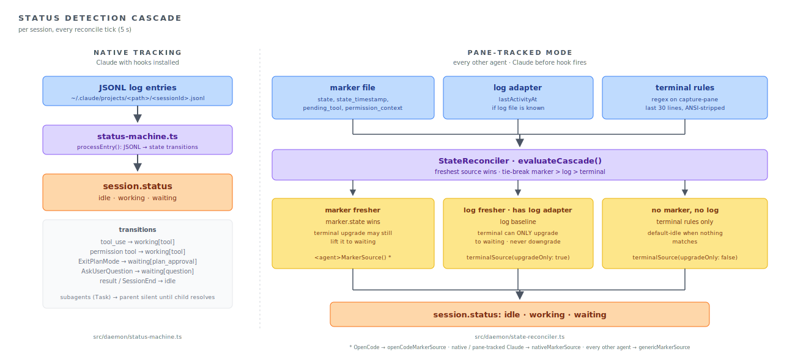

# Architecture

Deep-dive notes for contributors. For the high-level picture and the system overview diagram, see [the README](../README.md).

## The core problem

ccmux exists to bridge a fundamental gap: AI agents running in tmux panes are observable but not addressable from outside. A `ps` listing tells you "claude is alive in pane %12," but it can't tell you which Claude session UUID that maps to. Claude doesn't keep its JSONL log file open, so `lsof` won't link the PID to a log path. Antigravity, Codex, Cursor, OpenCode, and Pi each have their own variant of the same opacity.

The daemon merges three signals to derive per-session state, in order of trust:

| Signal            | Source                                                                   | Confidence                                         |
| :---------------- | :----------------------------------------------------------------------- | :------------------------------------------------- |
| Hook markers      | `~/.config/ccmux/session-pids/*.json` (written by hook scripts / plugin) | High. Agent-emitted lifecycle events.              |
| JSONL log entries | tailed log files, fed into the status machine                            | High. Exact tool calls, results.                   |
| Terminal patterns | regex over last 30 lines of `tmux capture-pane`                          | Low. Pattern-based, can miss scrolled-off prompts. |

## Status detection cascade

<picture>
  <source media="(prefers-color-scheme: dark)" srcset="./status-cascade-dark.svg">
  
</picture>

ccmux runs each session through one of two tracking modes per tick.

**`native`** is Claude only. The session has a real `nativeSessionId` (UUID), a known JSONL log file the daemon tails (`LogWatcher`), and a status state machine (`status-machine.ts`) that consumes log events: assistant `tool_use` becomes `working[tool]`; permission-required tools become `waiting[permission, pendingTool]`; `ExitPlanMode` becomes `waiting[plan_approval]`; `AskUserQuestion` becomes `waiting[question]`; result entries and `SessionEnd` become `idle`. Subagents (`Task` tools) flip the parent to silent-working until the child resolves.

**`pane-tracked`** is every other agent, plus Claude before its hook fires. The session is identified by tmux pane (synthetic ID like `codex_pane963`). Status comes from terminal scanning, hook markers (if installed), and log entries (if available).

Both modes converge on a single pure fold: `evaluateCascade()` in `cascade-evaluator.ts`. The reconciler builds a `CascadeSource[]` from whatever signals are available for the session (marker, log adapter output, terminal rules), and the evaluator picks the freshest one. Each source carries:

- a candidate `CascadeState` (status, attentionType, pendingTool),
- a timestamp,
- a tie-break priority (`marker > log > terminal`),
- an `upgradeOnly` flag.

`upgradeOnly` sources can lift the result to `waiting` but never downgrade. This is how a stale terminal-detected `waiting` still catches a transient permission UI even when logs say "idle", and how logs holding `working` survive a brief moment when the visible 30 lines don't contain ccmux's patterns. When two sources tie on timestamp, the priority order resolves the conflict.

Per-tick the reconciler assembles a slightly different source set:

- **Pane-tracked** (`reconcilePaneTrackedAgentSession`): `terminalSource()` (default-idle baseline), `genericMarkerSource()` if a marker exists, `logSource()` if a log adapter exists. OpenCode uses `openCodeMarkerSource()` to fold its multi-session aggregation in.
- **Native Claude / Codex** (`reconcileNativeCascadeSessions`): `nativeLogSource()` (the status-machine output) plus `nativeMarkerSource()` if a marker is present, with a targeted pane capture providing an `upgradeOnly` terminal source for stale "working" sessions (disambiguates "still going" from "stuck on plan approval").

A safety net: if the process PID is unknown (off-path session, crashed parent), log-file mtime caps a stale "working" to `idle` after 10 minutes (`status-machine.ts`).

## Session-to-pane binding (the binder)

A session (a discovered agent process, or a hook marker) has to be pinned to the tmux pane it lives in before the TUI can route you there. `binder/` (`scan.ts`, `assign.ts`, `migrate.ts`, `links.ts`, `cleanup.ts`, `primitives.ts`, …) owns that policy; `session-pane-match.ts` is a thin I/O wrapper — `matchSessionsToPanes` snapshots sessions + markers, calls `decideScanBindings`, and applies the emitted bindings to the real `SessionManager`.

Marker claims settle first, across all panes, and are authoritative — re-asserted every scan, so a mis-bind heals. Only then do the heuristic arms run over the post-marker state. `scan.ts` drives the per-scan ladder (marker → pane-holder → live-pid arms) on working copies that simulate the `SessionManager` setter semantics.

For panes no marker claims, each same-cwd group of sessions and candidate panes is solved as one small optimal assignment (`assign.ts`), gated by three guards:

- **D1 — direction skew:** a session's timestamp may precede its process start by at most a small skew.
- **D2 — tolerance cap:** a match beyond 600s of separation is rejected.
- **D3 — ambiguity refusal:** a near-tie leaves the row visibly unbound rather than guessing.

"Pane timestamp" survives only as the boot-migration fallback (`migrate.ts`), for procs whose `ps etime` start time is unparseable. There is no "most recent file" arm.

## Log tree watching

`log-tree-watcher.ts` is the recursive-`fs.watch`-backed substrate behind `LogWatcher` for the agent log trees (`~/.claude/projects`, `~/.codex/sessions`). It exists because chokidar arms one watcher per directory, and that setup alone cost seconds of daemon boot on session-heavy machines.

Platform event names are unreliable and FSEvents coalescing is stream-local, so events are classified by `stat` + a known-files set, and every event reconciles a subtree (walk for new files, sweep for gone ones). `ready` is deferred ~50ms to cover the stream's arming window. It falls back to chokidar when the root is missing or recursive watching is unsupported.

### Multiple Claude config dirs

Claude Code writes transcripts to `$CLAUDE_CONFIG_DIR/projects`, so a second account (a work login in `~/.claude` plus a personal one under `CLAUDE_CONFIG_DIR=~/.claude-personal`) lands in a separate tree. `resolveClaudeProjectDirs` (`lib/config.ts`) collects `~/.claude` plus every dir from the `additionalClaudeConfigDirs` preference and `CLAUDE_CONFIG_DIR` (deduped, primary first). The daemon stands up one `ClaudeLogAdapter` + `LogWatcher` per tree — the same fan-out shape as one-adapter-per-agent — all feeding the shared `SessionManager`. Empty unless configured, so default single-dir behavior is unchanged. Only extra trees add watchers; the primary `~/.claude/projects` watcher stays authoritative for marker-driven, path-agnostic `processPath` routing, and `buildLogPath` probes every tree to locate a session's transcript.

Because a transcript lives in exactly one tree, marker events route to the watcher that owns the session: `LogWatcher.ownsSession(id)` reports whether that tree has discovered the session's log, and the Claude adapter's `ownerFor` (`getLogWatchers("claude")` → `find(ownsSession) ?? watchers[0]`) picks the owning watcher, falling back to the primary for sessions no tree has discovered yet (e.g. a marker written before the first turn). For the same reason, per-watcher freshness state (`isRecentlyProcessed`) is folded across all Claude watchers in the reconciler, so a second-account session isn't invisible to the just-processed debounce guard.

## Hook lifecycle

<picture>
  <source media="(prefers-color-scheme: dark)" srcset="./hook-lifecycle-dark.svg">
  
</picture>

Without hooks, ccmux is best-effort: it scans pane content and guesses. With hooks installed via `ccmux setup`, agents emit authoritative lifecycle events that map to a stable session UUID, turning each agent from "seen" into "tracked."

### Marker file shape

The entire interface between ccmux and the agent is one JSON file per session, written via tmp+rename so the daemon's chokidar watcher only sees finished writes (`session-markers.ts`):

```ts
{
  agent_type: string,
  pid: number,
  tty?: string,                  // Omitted for OpenCode/Cursor (PID-ancestry pane correlation)
  session_id: string,
  transcript_path?: string,
  timestamp: number,
  state?: "idle" | "working" | "waiting_permission",
  state_timestamp?: number,      // Fresher than `timestamp` if set
  pending_tool?: string,         // From PermissionRequest hook (Codex/Cursor)
  permission_context?: string,
  directory?: string,            // OpenCode only
  title?: string,                // OpenCode only
  last_prompt?: string           // Cursor / OpenCode
}
```

### Per-agent strategies

| Agent       | Mechanism                                                                                                                                                                                                                                                                                         | Pane correlation                                  |
| :---------- | :------------------------------------------------------------------------------------------------------------------------------------------------------------------------------------------------------------------------------------------------------------------------------------------------ | :------------------------------------------------ |
| Antigravity | 2 shell scripts (`PreInvocation`, `Stop`) via global `~/.gemini/config/hooks.json`. The first `PreInvocation` creates the marker because Antigravity exposes no session-start hook.                                                                                                             | TTY match with PID-ancestry fallback              |
| Claude      | 3 shell scripts (`SessionStart`, `SessionEnd`, `Notification`) registered in `~/.claude/settings.json`.                                                                                                                                                                                           | TTY match (`marker.tty` to `pane.tty`)            |
| Codex       | 3 shell scripts (`SessionStart`, `Stop`, `PermissionRequest`) in `~/.codex/hooks.json`, plus the codex hooks feature flag in `config.toml` (`[features] codex_hooks = true` pre-0.124, `[features] hooks = true` on 0.124+; ccmux recognizes either).                                             | TTY match                                         |
| Cursor      | 4 shell scripts (`sessionStart`, `sessionEnd`, `beforeSubmitPrompt`, `stop`) via `~/.cursor/hooks.json`. Scripts walk PID ancestry to find the real `cursor-agent` PID (Cursor invokes hooks via `/bin/zsh -c`, so `$PPID` is a transient shell).                                                 | PID-ancestry: `ctx.getPaneHostingPid(marker.pid)` |
| OpenCode    | One JS plugin at `~/.config/opencode/plugin/ccmux.js` subscribed to OpenCode's message bus (no shell hooks; pure `node:fs/promises` so the same file runs on Bun or Node).                                                                                                                        | PID-ancestry; one server hosts N sessions         |
| Pi          | One JS extension at `~/.pi/agent/extensions/ccmux.js` subscribed to Pi's lifecycle events (no shell hooks; pure `node:fs/promises`, auto-discovered and loaded via jiti). Writes the marker at `session_start`, which fires at launch with full identity (pid, session id, transcript path, cwd). | PID-ancestry; one session per process             |

### Lifecycle (`hook-manager.ts`)

1. `ccmux setup` runs `adapter.install()`. Idempotent: writes scripts and edits agent config.
2. Agent fires hook, script writes marker file.
3. `HookManager.start()` first replays existing on-disk markers (covers "daemon was down when agent booted"), then opens chokidar with `ignoreInitial: true`.
4. Add event triggers `adapter.onMarkerAdded(marker, ctx)`. The adapter locates the matching pane-tracked session, sets `nativeSessionId`, `logPath`, `cwd`, and (Claude) starts log-tailing. A marker written before the daemon's first scan created the pane-tracked session would otherwise be orphaned; the shared, agent-agnostic `reconcileSessionMarkerLinks()` (`adapters/link.ts`, keyed off `adapter.agentType`) closes that race on the next scan and re-derives native-id ownership each scan so a mis-linked id heals.
5. Per-turn signals (Antigravity `PreInvocation`/`Stop`, Claude `Notification`, Codex `PermissionRequest`, Cursor `beforeSubmitPrompt`, OpenCode `permission.asked`, Pi `agent_start`/`agent_end`) update the marker's `state` and `state_timestamp`. The next reconcile tick picks them up via the freshest-wins cascade (`evaluateCascade()`).
6. Cleanup: `cleanupStaleMarkers()` groups by `(agent_type, session_id)`, dedupes, and applies a 3-level liveness check (PID, TTY, adapter callback `isSessionStillLive`); any failed check unlinks the marker.

### OpenCode aggregation

OpenCode is the special case. A single OpenCode server process hosts N sessions, so N markers share one PID. `aggregateOpenCodeMarkers()` (`adapters/opencode/aggregate.ts`) folds them into one ccmux session with worst-of status (waiting > working > idle). `attentionType`, `pendingTool`, `cwd`, and `nativeSessionId` follow the newest-waiting or newest-activity marker. Re-folded on every reconcile tick (not just on marker add or remove), so newly-waiting siblings show up promptly.

## Single source of truth for adapters

`createBuiltinHookAdapters()` in `src/daemon/adapters/index.ts` is consumed by both the daemon (for runtime registration) and `setup.ts` (for install / uninstall commands). This prevents the historic footgun where a new adapter got registered for daemon dispatch but not for `ccmux setup` (or vice versa).

## Programmatic invocation (`/invoke`)

`POST /invoke` and the `ccmux invoke` CLI drive a single agent turn programmatically. The path is split behind a registry seam:

- `InvocationManager` (`src/daemon/invocation-manager.ts`) owns the request lifecycle — concurrency cap, duplicate-id guard, cancel-before-start stash, and per-invocation timeout. It does not know how any specific agent runs. It also keeps a status-only store of active + recently-finished invocations (TTL-purged) and is an `EventEmitter` (fires `change` at start/finish); `GET /invocations` reads the store and `ccmux invoke list` renders it.
- `InvocationRegistry` (`src/daemon/invokers/registry.ts`) maps an `AgentDef` to an `Invoker`. Agents with `invokeMode` set go to `SubprocessInvoker` (`Bun.spawn` against `agent.invokeMode.args`); the built-in `claude` agent goes to `ClaudeInvoker` (drives the interactive TUI inside a detached `ccmux-invoke-<id>` tmux session and parses the transcript JSONL).
- `capabilitiesFor(agent, invoker)` derives `InvokerCapabilities` (`requiresHooks`, `supportsSessionResume`) from the invoker kind — the claude-interactive branch returns fixed capabilities, the subprocess branch reads the agent's `invokeMode` — and the server gates pre-flight checks (e.g., Claude's hooks precheck) through it. Invokers declare no capabilities of their own, so `AgentDef` stays the only place registering which agent can do what.

This split lets the manager stay generic, lets each invoker focus on one execution mode, and lets the server reject impossible requests (e.g., `--session` against a non-resumable agent) before the manager spends a slot.

`SubprocessInvoker` pipes the prompt via stdin, except when `invokeMode.args` carries a `{prompt}` placeholder (gemini's `-p {prompt}`): then the prompt rides in argv (stdin skipped), capped at `MAX_ARGV_PROMPT_BYTES` (120 KiB) to avoid a Linux-only `execve` E2BIG. Full output of subprocess invokes is captured to an ephemeral per-daemon store (`invocation-results.ts`): each invoke's stdout/stderr is written to a `0700` `mkdtemp` dir keyed by id (5 MiB cap), and `ccmux invoke result <id>` reads it back via the server, reap-tolerant (a gone file is a clean miss; cleanup is delegated to the OS `/tmp` reaper). Claude invokes drive a tmux session with no stdout buffer, so their `result` is always a miss in v1.

The board renders these invokes live. The server broadcasts `invocation_started` / `invocation_finished` SSE events (via the pure `invocationEventToSSE` mapping) and embeds an `invocations` snapshot in the `init` event for reconnect reconciliation. The TUI store synthesizes a paneless row per subprocess invoke (a Claude invoke already appears as its real `ccmux-invoke-<id>` session, so it is skipped to avoid a duplicate), surfaces a live `N invoking` count, and routes kill / restart on such a row through `POST /invoke/:id/cancel` (a one-shot worker has no real session to kill). `kill-all` is reaped daemon-side instead: `handleKillAllSessions` cancels every in-flight invocation from `InvocationManager.listInvocations()` (the authoritative set), since the client's in-flight set is a lossy mirror that never hydrates invokes a mid-run-opened TUI did not see start. Synthetic rows carry `tmuxPane: null`, so the picker's pane-touching paths (attach, preview, switch) all guard on a real pane.

## PR enrichment

`pr-resolver.ts` maps an agent-agnostic `(cwd, branch)` to its open PR via `gh pr list --head`. Owned by the Server (like `branchCache`). Reads are synchronous against a split-TTL cache (stale-while-revalidate; default branches skipped):

- Successful lookups expire after 2 min, so merges clear and new PRs appear quickly.
- Failed lookups (null) hold for 10 min as backoff — their causes (no GitHub remote, logged-out `gh`, deleted cwd) persist on the minutes scale.

Refreshes run in the background; a changed value re-broadcasts the affected sessions via `session_updated`. Because refreshes are demand-driven, the Server also sweeps enrichment over visible sessions every 2 min so a fully idle row can't serve a stale PR indefinitely (worst-case staleness ≈ TTL + sweep interval, ~4 min).

Fail-soft: a thrown spawn disables the resolver for the daemon's lifetime only when a `Bun.which("gh")` probe confirms the binary is missing; otherwise (e.g. a deleted worktree cwd) the key is negative-cached. A non-zero `gh` exit (not a repo, no GitHub remote, unauthed) is likewise a per-key negative.

The lookup also fetches `reviewDecision` and `statusCheckRollup`, folding the rollup daemon-side via `foldChecks` (mirrors gh's PR-status rollup as shown by `gh pr view` / `gh pr status`; empty rollup = `"none"`, never `"passing"`) into the `reviewDecision` / `ciStatus` fields on each `BranchPR` that drive the TUI's PR-cell color. `samePRs` compares these, so a CI or review flip re-broadcasts the session even when id and href are unchanged. Feeds `EnrichedSession.branchPRs`; the TUI's `pr` field prefers background rows' authoritative `backgroundChildren` and falls back to this.

## Whole-session search

TUI search unions four sources so a query can match more than the last prompt. Three are instant and client-side (fuzzy over the four identity fields; substring over an in-memory prompt index; substring over captured pane content); the fourth reads live transcripts on demand via the daemon.

- **Prompt index.** Each `Session` carries a `prompts` array (oldest→newest), maintained by `appendPrompt` (`status-machine.ts`) and capped by count / per-prompt chars / total bytes (`MAX_SESSION_PROMPTS`, `MAX_PROMPT_CHARS`, `MAX_PROMPTS_TOTAL_BYTES` in `config.ts`). Claude/Codex derive it from the log (replace branch in `SessionManager.updateSession`); marker-driven agents append from `lastPrompt`. It rides the SSE `Session` payload, so it is tail-bounded after a daemon restart.
- **Transcript search.** `GET /search?q=` (`server.ts` → `transcript-search.ts`) tail-reads each visible Claude/Codex transcript (2 MB cap, 8-way concurrency), extracts user + assistant text (tool calls / results / thinking skipped), and returns windowed snippets. A cheap raw-content pre-filter skips the full parse for non-matching sessions when the query holds no JSON-escaped chars. The TUI fetches it debounced, guarded by a generation counter against out-of-order responses.

## Background agents (paneless Claude)

A third tracking mode, `background`, is owned solely by `sources/claude-background.ts` and is excluded from every reconciler arm (`reconcileOne`, `reconcileAttentionStates`, `cleanupStaleSessions`, `matchSessionsToPanes`) and from the kill paths (`handleKillSession` / `handleKillAllSessions`). These rows are Claude Code background agents (`claude --bg` / the agent view): paneless (PID + cwd + JSONL transcript, no tmux pane) and read-only (removed via `claude rm`, not killed).

The source watches Claude's own `~/.claude/daemon/roster.json` (authoritative live membership and the SOLE death signal) and each `~/.claude/jobs/<short>/state.json` (status — needed because roster mtime does not bump on the active→blocked transition). `deriveBackgroundState` (`background-state.ts`) is the pure status fold; the source diffs the roster into the `SessionManager`. Independent of hooks and pane scanning.

Constructed in `Daemon.start()` only when `backgroundAgents !== false` (opt-out config gate; off means no watchers, no rows, no per-scan resync). Interactions: a peek preview plus a `claude attach` launcher.

## Daemon lifecycle and boot ordering

The Server (`server.ts`) starts at the top of `Daemon.start()`, before session migration, marker replay, and the initial scan: auto-start callers poll `/health` on a short budget, and a session-heavy boot would otherwise outlast it. Early SSE clients get a sparse `init` and hydrate live via `session_created` / `session_updated`. `GET /server-info` returns `{ socketPath: string | null }`, the tmux socket the daemon scans, so consumers can refuse cross-server pane targeting.

`POST /sessions/:id/send` routes single-line text through `sendLiteralToPane` and multiline text through `sendPromptToPane` in `pane-io.ts`; the latter uses tmux bracketed paste so embedded newlines remain one prompt, and both paths honor requests that paste without pressing Enter.

`lifecycle.ts` owns process management: PID-file read/write, HTTP `/health` liveness (used instead of the PID file alone, because a dead daemon's PID can be recycled by an unrelated process — a false positive would suppress auto-start), detached background spawn, and PID-reuse-safe zombie-port recovery. `stopDaemonByPort` signals only the confirmed port LISTENer found via `findDaemonPidByPort` (`lsof -sTCP:LISTEN`), never the PID-file PID, and spares a foreign squatter whose `ps` command line isn't `daemon start` (fail-open on an unreadable cmd to preserve recovery). The auto-start/recovery flow that composes these lives in `src/commands/shared.ts` (`ensureDaemon` → `launchDaemon`: evict the zombie holding the port, spawn fresh, wait for health, surface the blocker's PID/cmd on failure), shared by every CLI entrypoint.

## Where to look in the code

| Concern                                                                                                                 | Path                                          |
| :---------------------------------------------------------------------------------------------------------------------- | :-------------------------------------------- |
| Daemon entry, scan loop                                                                                                 | `src/daemon/index.ts`                         |
| Daemon process, PID file, port recovery                                                                                 | `src/daemon/lifecycle.ts`                     |
| Per-tick reconciliation cascade                                                                                         | `src/daemon/state-reconciler.ts`              |
| Pure freshest-wins-with-tiebreak fold                                                                                   | `src/daemon/cascade-evaluator.ts`             |
| JSONL to state transitions                                                                                              | `src/daemon/status-machine.ts`                |
| Regex on pane content                                                                                                   | `src/daemon/terminal-detector.ts`             |
| Recursive log-tree watcher                                                                                              | `src/daemon/log-tree-watcher.ts`              |
| Pane title / state heuristic (`classifyPaneTitle`, Braille spinner / `✳`; `detectPaneState` for Claude pane inspection) | `src/daemon/pane-classify.ts`                 |
| `tmux capture-pane` wrapper                                                                                             | `src/daemon/pane-io.ts`                       |
| Tmux pane listing, PID-to-pane                                                                                          | `src/daemon/pane-discovery.ts`                |
| Session-to-pane matching policy (binder)                                                                                | `src/daemon/binder/`                          |
| Binder I/O wrapper (`matchSessionsToPanes`)                                                                             | `src/daemon/session-pane-match.ts`            |
| Agent process discovery                                                                                                 | `src/daemon/processes.ts`                     |
| `ccmux-invoke-*` detached session lifecycle                                                                             | `src/daemon/detached-session.ts`              |
| chokidar over markers, dispatch to adapters                                                                             | `src/daemon/hook-manager.ts`                  |
| Marker file shape, cache, cleanup                                                                                       | `src/daemon/session-markers.ts`               |
| Per-agent install + marker handling                                                                                     | `src/daemon/adapters/<agent>/hook-adapter.ts` |
| Adapter factory (single source of truth)                                                                                | `src/daemon/adapters/index.ts`                |
| SessionManager (EventEmitter)                                                                                           | `src/daemon/sessions.ts`                      |
| HTTP REST + SSE on port 2269                                                                                            | `src/daemon/server.ts`                        |
| Whole-session transcript search (`GET /search`)                                                                         | `src/daemon/transcript-search.ts`             |
| Codex rollout line parsing (shared by adapter + search)                                                                 | `src/daemon/adapters/codex/parse.ts`          |
| In-memory per-session prompt index (`appendPrompt`, caps in `config.ts`)                                                | `src/daemon/status-machine.ts`                |
| `(cwd, branch)` → open-PR lookup                                                                                        | `src/daemon/pr-resolver.ts`                   |
| Paneless Claude background-agent source                                                                                 | `src/daemon/sources/claude-background.ts`     |
| `/invoke` request lifecycle                                                                                             | `src/daemon/invocation-manager.ts`            |
| Subprocess invoke output store                                                                                          | `src/daemon/invocation-results.ts`            |
| Invoker interface + capabilities                                                                                        | `src/daemon/invokers/invoker.ts`              |
| Agent-to-invoker dispatch                                                                                               | `src/daemon/invokers/registry.ts`             |
| Claude interactive-tmux invoker                                                                                         | `src/daemon/invokers/claude-invoker.ts`       |
| Subprocess invoker (Codex/Cursor/etc.)                                                                                  | `src/daemon/invokers/subprocess-invoker.ts`   |
| Setup install/uninstall flow                                                                                            | `src/commands/setup.ts`                       |
